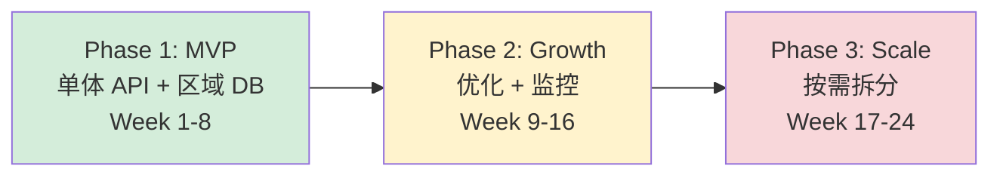
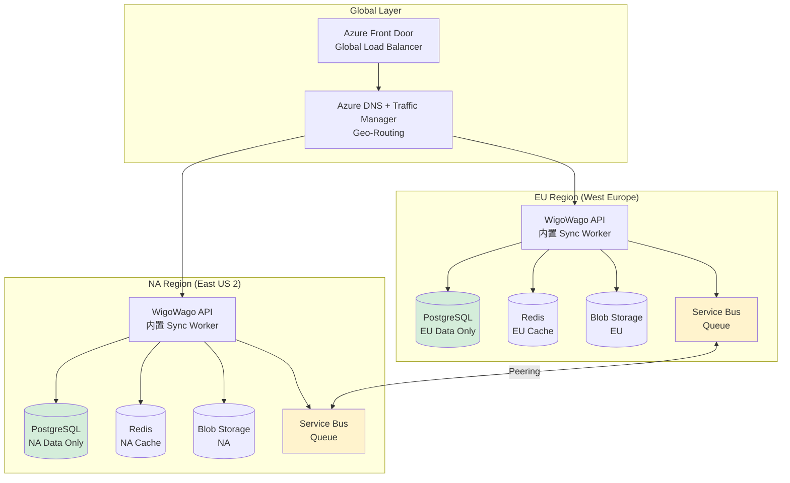
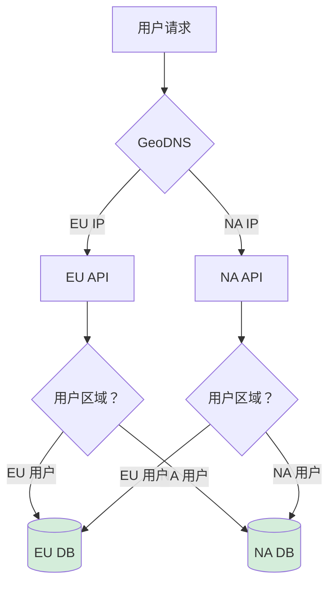

# WigoWago V2 - 轻量级分布式架构设计

> **版本**: 1.0 (Lite)  
> **创建日期**: 2026-04-08  
> **状态**: 设计阶段  
> **合规框架**: GDPR、EU-US Data Privacy Framework  
> **设计原则**: 单体优先、按需拆分、轻量运维

---

## 💡 设计原则 (基于 Twitter/X 教训)

| 原则 | 说明 | 来源 |
|------|------|------|
| **单体优先** | 初期保持单体，避免过早微服务化 | Twitter 早期过度拆分导致运维灾难 |
| **异步通信** | 跨区域使用消息队列，避免级联故障 | 行业标准实践 |
| **监控内置** | 从 Day 1 开始监控，而非事后补充 | 初创公司常见错误 |
| **无状态设计** | API 无状态，便于水平扩展 | 云原生最佳实践 |
| **GDPR 合规** | 数据本地化是核心需求，不可妥协 | 法律要求 |

---

## 🎯 架构演进策略



| 阶段 | 时间 | 用户规模 | 架构 | 团队规模 |
|------|------|----------|------|----------|
| **MVP** | Week 1-8 | < 1 万 | 单体 API + 区域 DB | 2-3 人 |
| **Growth** | Week 9-16 | < 10 万 | 优化 + 监控 | 3-5 人 |
| **Scale** | Week 17-24 | < 100 万 | 按需拆分 | 5-10 人 |

---

## 🏗️ 架构设计 (轻量版)

### 核心变更

**相比原 V2 设计的简化**:

| 组件 | 原设计 | 轻量版 | 理由 |
|------|--------|--------|------|
| **Global Sync Service** | 独立服务 | API 内置模块 | 减少运维成本 |
| **Kubernetes** | AKS | App Service | 免 K8s 运维 |
| **API Gateway** | Azure APIM | 内置 | 初期不需要 |
| **Service Bus** | Premium | Standard | 标准层足够 |

### 架构图



---

## 📦 基础设施配置 (MVP)

### EU Region (West Europe - Amsterdam)

| 服务 | SKU | 月成本 | 说明 |
|------|-----|--------|------|
| **App Service** | Premium V3 (2 核 4GB) | €150 | 容器部署，自动扩缩容 |
| **PostgreSQL** | Flexible Server (2 核 4GB) | €200 | 主库，100GB 存储 |
| **Redis** | Cache for Redis (Basic C) | €50 | 缓存 + Session |
| **Blob Storage** | LRS | €20 | 媒体文件 |
| **Service Bus** | Standard | €30 | 跨区域同步 |
| **Application Insights** | Pay-as-you-go | €50 | 监控 + 日志 |
| **Front Door** | Standard | €50 | 全球负载均衡 |

**EU 区域月成本**: ~€550

### NA Region (East US 2 - Virginia)

| 服务 | SKU | 月成本 | 说明 |
|------|-----|--------|------|
| **同上配置** | - | ~$500 | - |

**NA 区域月成本**: ~$500

### 总成本

**MVP 阶段**: ~$1,000/月（双区域）

**对比**:
- 原 V2 设计 (AKS + Premium): ~$5,000/月
- **节省**: 80% 成本

---

## 🔄 跨区域同步 (内置模块)

### 设计变更

**原设计**: Global Sync Service (独立服务)  
**轻量版**: 内置于 API 的 Sync Worker

### 实现方式

```typescript
// src/infra/sync/cross-region-sync.worker.ts

import { ServiceBusClient } from '@azure/service-bus';

export class CrossRegionSyncWorker {
  private serviceBusClient: ServiceBusClient;
  private queueName: string;

  constructor() {
    this.serviceBusClient = ServiceBusClient.createFromConnectionString(
      process.env.SERVICE_BUS_CONNECTION_STRING!
    );
    this.queueName = 'cross-region-sync';
  }

  // 启动 Worker（在 API 启动时调用）
  async start(): Promise<void> {
    const receiver = this.serviceBusClient.createReceiver(this.queueName);
    
    receiver.subscribe({
      processMessage: async (message) => {
        const event = JSON.parse(message.body as string);
        await this.processSyncEvent(event);
        await message.complete();
      },
      processError: async (error) => {
        logger.error('Sync worker error', error);
      }
    });

    logger.info('Cross-region sync worker started');
  }

  // 处理同步事件
  private async processSyncEvent(event: SyncEvent): Promise<void> {
    // 1. GDPR 合规检查
    if (!this.isCompliant(event)) {
      logger.warn('Non-compliant event skipped', event);
      return;
    }

    // 2. 应用同步规则
    if (this.shouldSync(event)) {
      await this.applySync(event);
    }
  }

  // 发布同步事件（在业务逻辑中调用）
  async publishSyncEvent(event: SyncEvent): Promise<void> {
    const sender = this.serviceBusClient.createSender(this.queueName);
    await sender.sendMessages({
      body: JSON.stringify(event),
      messageId: event.eventId,
    });
    await sender.close();
  }
}

// 在 API 启动时启动 Worker
// src/main.ts
const syncWorker = new CrossRegionSyncWorker();
await syncWorker.start();
```

### 优势

| 优势 | 说明 |
|------|------|
| ✅ **减少服务** | 无需独立部署 Global Sync Service |
| ✅ **代码共享** | 同步逻辑与业务逻辑在一起 |
| ✅ **部署简单** | 随 API 一起部署 |
| ✅ **未来可扩展** | 可轻松拆分为独立服务 |

---

## 📊 数据分区策略

### 用户路由



### 数据分类

| 类别 | 示例 | 存储策略 | 同步策略 |
|------|------|----------|----------|
| **Tier 1: PII** | User, Auth | 严格区域化 | ❌ 不同步 |
| **Tier 2: UGC** | Post (公开) | 区域存储 | ✅ 选择性同步 |
| **Tier 3: 系统** | Config, Tags | 全局共享 | ✅ 全量同步 |
| **Tier 4: 媒体** | Images, Videos | CDN 分发 | ✅ 异步复制 |

---

## 🚀 技术实施方案

### Phase 1: MVP (Week 1-8)

**目标**: 快速上线，验证产品

```bash
# Week 1-2: 基础设施
- 创建 EU/NA 资源组
- 部署 App Service
- 部署 PostgreSQL
- 配置 Service Bus Peering

# Week 3-4: 应用改造
- 多数据源支持
- 区域路由中间件
- 内置 Sync Worker

# Week 5-6: 数据迁移
- EU 用户数据迁移
- 验证数据一致性

# Week 7-8: 测试上线
- 集成测试
- 性能测试
- 灰度发布
```

### Phase 2: Growth (Week 9-16)

**目标**: 支撑 10 万用户

- 添加 Redis 缓存层
- 优化数据库查询
- 完善监控告警
- 性能调优

### Phase 3: Scale (Week 17-24)

**目标**: 支撑 100 万用户

- 评估 K8s 迁移
- 按需拆分服务
- 添加 CDN
- 全球加速

---

## ⚠️ 风险与缓解

### 技术风险

| 风险 | 影响 | 概率 | 缓解措施 |
|------|------|------|----------|
| 数据同步延迟 | 中 | 中 | 异步最终一致性，UI 提示 |
| 跨区域查询性能 | 中 | 高 | 缓存层，预聚合 |
| 单区域故障 | 高 | 低 | 手动切换流程 |

### 合规风险

| 风险 | 影响 | 概率 | 缓解措施 |
|------|------|------|----------|
| GDPR 违规 | 极高 | 低 | 法律顾问审查，DPIA |
| 用户投诉 | 高 | 中 | 透明政策，用户控制 |

---

## 📋 检查清单

### MVP 上线前

```markdown
## 基础设施
- [ ] EU App Service 部署
- [ ] EU PostgreSQL 部署
- [ ] EU Redis 部署
- [ ] Service Bus Peering 配置
- [ ] Front Door 配置

## 应用改造
- [ ] 多数据源支持
- [ ] 区域路由中间件
- [ ] 内置 Sync Worker
- [ ] GDPR 审计日志

## 数据迁移
- [ ] EU 用户识别
- [ ] 数据导出脚本
- [ ] 数据导入脚本
- [ ] 一致性验证

## 合规
- [ ] DPIA (数据保护影响评估)
- [ ] SCCs 签署
- [ ] 隐私政策更新
- [ ] 用户同意管理
```

---

## 📎 附录

### A. 环境变量配置

```bash
# EU Region
EU_DB_HOST=wigowago-eu.postgres.database.azure.com
EU_DB_NAME=wigowago_eu
EU_REDIS_HOST=wigowago-eu.redis.cache.windows.net
EU_STORAGE_ACCOUNT=wigowagoeu
EU_SERVICE_BUS=wigowago-eu.servicebus.windows.net

# NA Region
NA_DB_HOST=wigowago-na.postgres.database.azure.com
NA_DB_NAME=wigowago_na
NA_REDIS_HOST=wigowago-na.redis.cache.windows.net
NA_STORAGE_ACCOUNT=wigowagona
NA_SERVICE_BUS=wigowago-na.servicebus.windows.net

# Global
GLOBAL_FRONT_DOOR=wigowago.azurefd.net
```

### B. Terraform 配置 (简化版)

```hcl
# EU Region
resource "azurerm_resource_group" "eu" {
  name     = "wigowago-eu-rg"
  location = "westeurope"
}

resource "azurerm_postgresql_flexible_server" "eu" {
  name                = "wigowago-eu-postgres"
  resource_group_name = azurerm_resource_group.eu.name
  location            = azurerm_resource_group.eu.location
  
  sku_name   = "GP_Standard_B2ms"
  storage_mb = 102400
  
  administrator_login    = "postgres"
  administrator_password = var.db_password
}

# NA Region (类似配置)
```

---

*本文档由 AI 助手生成，需经法律和技术团队审查后实施。*
