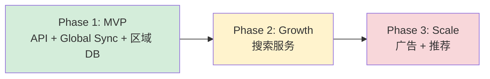
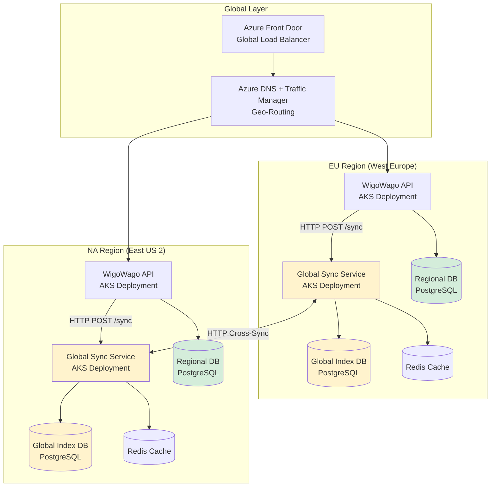
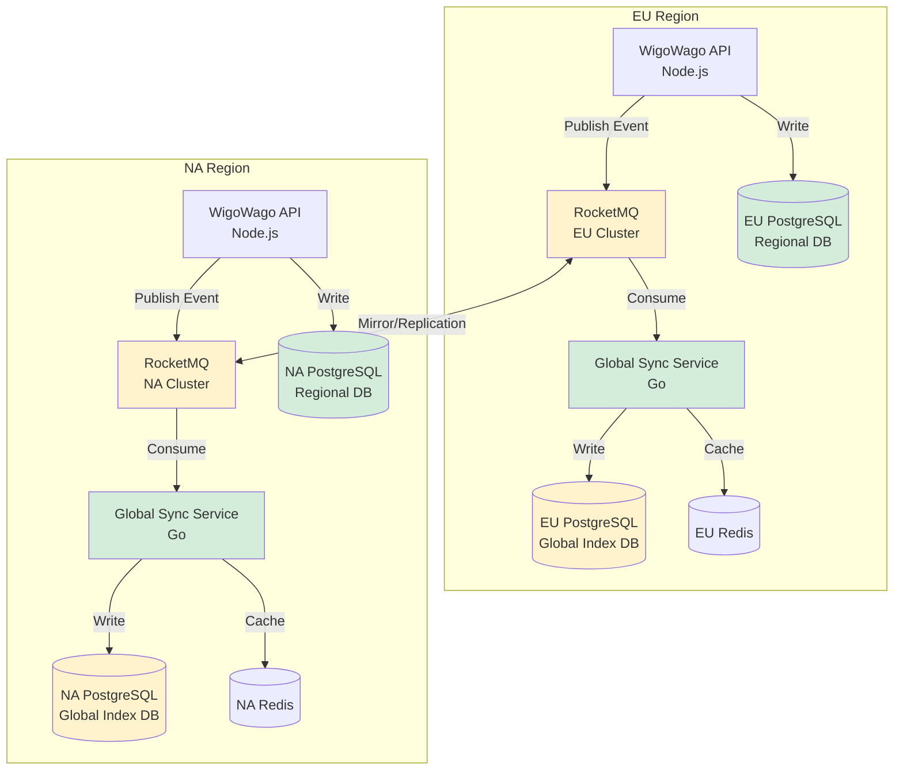
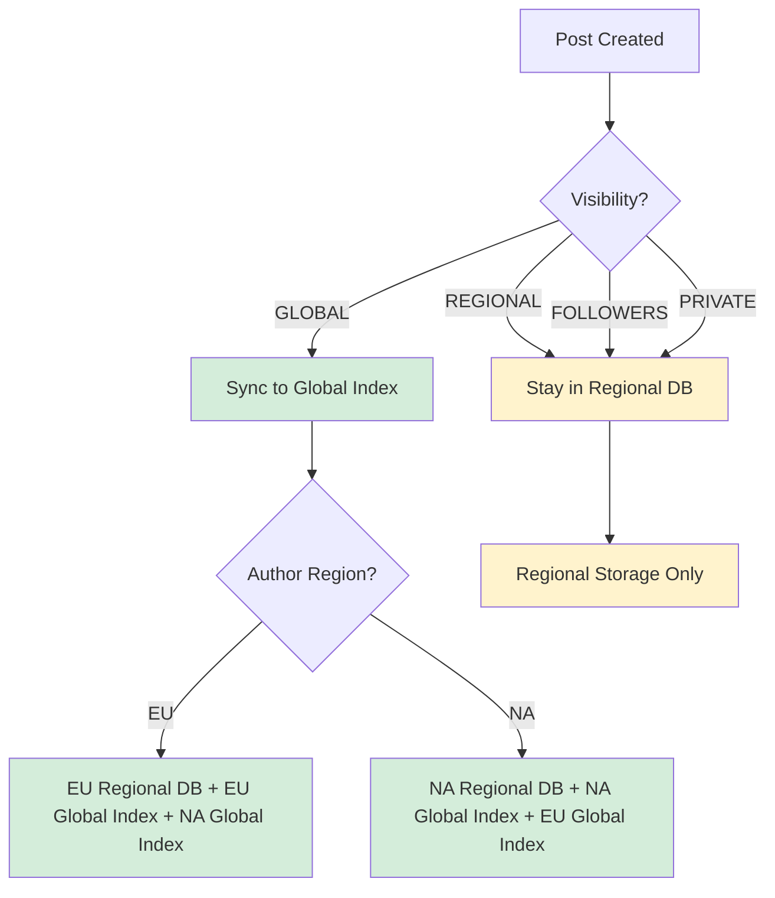
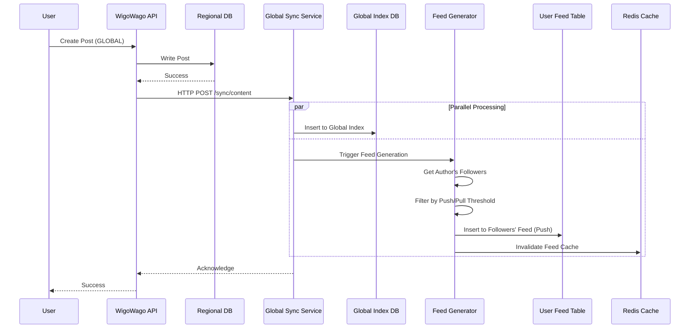
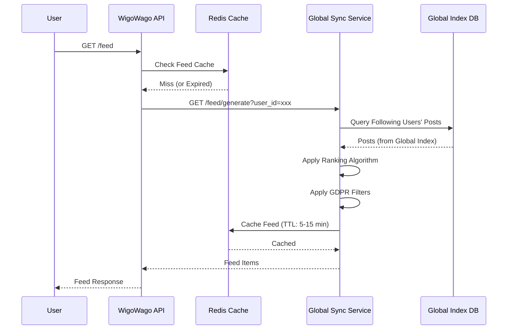
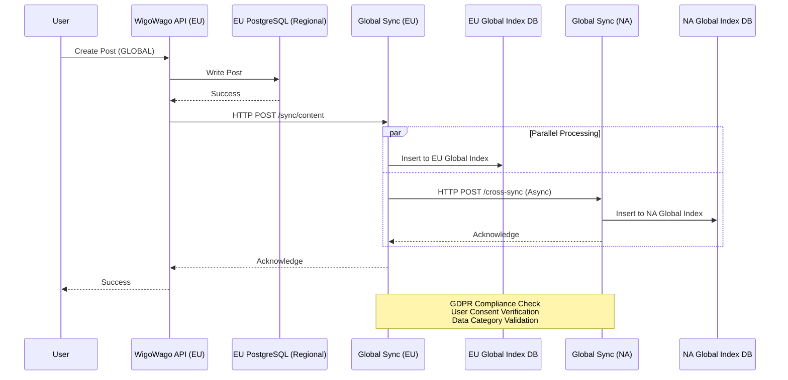
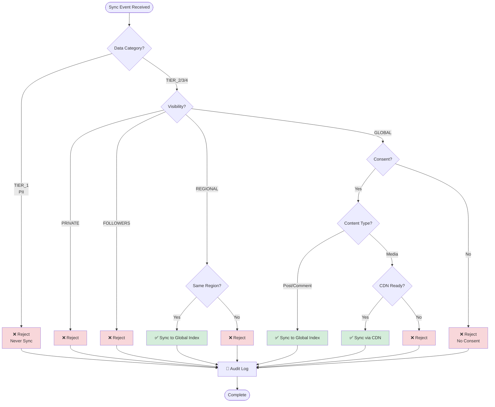
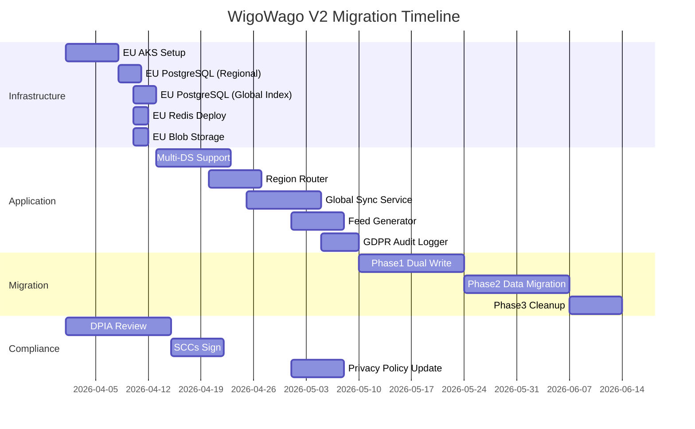

# WigoWago V2 - 分布式架构设计文档

> **版本**: 3.0 (完整架构 + Global Feed)  
> **创建日期**: 2026-04-08  
> **更新日期**: 2026-04-08  
> **状态**: 设计阶段  
> **合规框架**: GDPR、EU-US Data Privacy Framework  
> **架构模式**: 区域化分片 + Global Sync Service + 混合 Feed 模式

---

## 📋 目录

1. [执行摘要](#执行摘要)
2. [GDPR 合规要求](#GDPR 合规要求)
3. [当前架构分析](#当前架构分析)
4. [分布式架构设计](#分布式架构设计)
5. [数据分区策略](#数据分区策略)
6. [Global Feed 设计](#Global Feed 设计)
7. [跨区域同步机制](#跨区域同步机制)
8. [技术实施方案](#技术实施方案)
9. [迁移计划](#迁移计划)
10. [风险与缓解](#风险与缓解)

---

## 🎯 执行摘要

### 业务诉求

- **当前状态**: 单体服务，部署在北美 Azure (eastus2) AKS 集群
- **目标**: 部署欧洲集群，满足 GDPR 数据本地化要求
- **挑战**: 在合规前提下实现跨区域数据共享（用户 Posts 等内容）

### 架构演进策略



| 阶段 | 时间 | 用户规模 | 服务数量 |
|------|------|----------|----------|
| **MVP** | Week 1-8 | < 10 万 | 2 (API + Global Sync) |
| **Growth** | Week 9-16 | < 100 万 | 3 (+ 搜索服务) |
| **Scale** | Week 17-24 | > 100 万 | 5 (+ 广告 + 推荐) |

### 架构概览



### 核心组件

| 组件 | 功能 | 部署位置 | 数据存储 | 技术选型 |
|------|------|----------|----------|----------|
| **WigoWago API** | 业务逻辑、CRUD、用户认证 | 区域 (EU/NA) | Regional DB (PostgreSQL) | Node.js + AKS |
| **Global Sync Service** | 跨区域同步、全球索引、Feed 生成 | 区域 (EU/NA) | Global Index DB (PostgreSQL) + Redis | **Go + RocketMQ** + AKS |
| **Azure Front Door** | 全球负载均衡、SSL 终止 | Global | N/A | Azure FD Standard |
| **RocketMQ** | 异步事件消息队列 | 区域 (EU/NA) | 消息持久化 | Apache RocketMQ (已有) |
| **PostgreSQL** | 区域数据 + 全球索引 | 区域 | Regional DB + Global Index DB | Azure PostgreSQL Flexible |
| **Redis** | 缓存层 | 区域 | Global Cache | Azure Cache for Redis |

---

## 📜 GDPR 合规要求

### GDPR 核心要求 (2025-2026 更新)

#### 1. 数据本地化要求

| 数据类型 | 示例 | 存储要求 | 跨境传输 | Global Sync 处理 |
|----------|------|----------|----------|------------------|
| **Tier 1: 个人身份信息 (PII)** | User, UserProfile, UserAuth | 必须 EU 境内 | ❌ 禁止（除非明确同意） | 不同步 |
| **Tier 2: 认证凭证** | Password, Token, Session | 必须 EU 境内 | ❌ 禁止 | 不同步 |
| **Tier 3: 私密内容** | Private Posts, DM | 必须 EU 境内 | ❌ 禁止 | 不同步 |
| **Tier 4: 公开内容** | Public Posts, Comments | 建议 EU 境内 | ✅ 允许（SCCs 保障） | 同步到 Global Index |
| **Tier 5: 媒体文件 (公开)** | Images, Videos | 建议 EU 境内 | ✅ 允许 | CDN 分发 |
| **Tier 6: 系统数据** | Config, Tags, Places | 全局共享 | ✅ 允许 | 全量同步 |

#### 2. 跨境传输机制

根据 2025 年 GDPR 更新，跨境传输需要：

**1. 充分性决定 (Adequacy Decision)**
- EU-US Data Privacy Framework (2023 年 7 月生效)
- 适用于认证的美国组织
- 需年度重新认证

**2. 标准合同条款 (SCCs)**
- 2025 年更新的 SCCs
- 需要传输影响评估 (TIA)
- 必须记录所有跨境传输

**3. 用户同意机制**
- 明确同意 (Opt-in) 用于行为广告
- 可随时撤回同意
- 必须记录同意历史

#### 3. 用户权利 (GDPR Chapter 3)

| 权利 | 条款 | 实现方式 |
|------|------|----------|
| **访问权** | Art. 15 | 用户可导出其所有数据 (Data Export API) |
| **删除权 (被遗忘权)** | Art. 17 | 必须彻底删除所有副本 (包括 Global Index) |
| **限制处理权** | Art. 18 | 用户可限制数据跨境传输 |
| **数据可携带权** | Art. 20 | 支持数据导出为标准格式 (JSON/CSV) |
| **反对权** | Art. 21 | 用户可反对数据处理（如广告） |

#### 4. 违规处罚

| 违规类型 | 处罚标准 | 示例 |
|----------|----------|------|
| **一般违规** | €10M 或 2% 全球年收入 | 记录保存不完整 |
| **严重违规** | €20M 或 4% 全球年收入 | 数据泄露、违反数据本地化 |
| **报告时限** | 48 小时内 | 数据泄露必须报告 |

#### 5. 合规检查清单

```markdown
## 数据本地化
- [ ] EU 用户 PII 存储在 EU 境内
- [ ] EU 用户认证凭证存储在 EU 境内
- [ ] EU 用户私密内容存储在 EU 境内

## 跨境传输
- [ ] SCCs 已签署
- [ ] TIA (传输影响评估) 已完成
- [ ] 跨境传输日志已记录

## 用户权利
- [ ] Data Export API 已实现
- [ ] 删除权 (被遗忘权) 已实现
- [ ] 同意管理已实现

## 审计与日志
- [ ] 跨境传输审计日志
- [ ] 用户同意历史记录
- [ ] 数据删除记录
```

---

## 🔍 当前架构分析

### 技术栈

```
┌─────────────────────────────────────────────────┐
│              WigoWago API (Monolith)            │
│              Node.js + TypeScript               │
├─────────────────────────────────────────────────┤
│  Express.js (HTTP Server)                       │
│  TypeORM (ORM Layer)                            │
│  JWT Authentication                             │
├─────────────────────────────────────────────────┤
│  PostgreSQL (Single Instance - East US 2)       │
│  Redis (Cache & Session)                        │
│  Azure Blob Storage (East US 2)                 │
│  Firebase Auth                                  │
└─────────────────────────────────────────────────┘
```

### 数据模型分析

| 实体 | 包含 PII | 当前存储位置 | V2 存储策略 | 同步策略 |
|------|---------|-------------|------------|----------|
| `User` | ✅ | NA | Regional DB (区域化) | ❌ 不同步 |
| `UserProfile` | ✅ | NA | Regional DB (区域化) | ❌ 不同步 |
| `UserAuth` | ✅ | NA | Regional DB (区域化) | ❌ 不同步 |
| `Post` | ⚠️ (部分) | NA | Regional DB + Global Index | ✅ 公共可同步 |
| `PostMedia` | ⚠️ | NA | Regional Blob + CDN | ✅ 公共可同步 |
| `Pet` | ❌ | NA | Regional DB (区域化) | ❌ 不同步 |
| `Group` | ⚠️ | NA | Regional DB (区域化) | ❌ 不同步 |
| `Comment` | ⚠️ | NA | Regional DB + Global Index | ✅ 跟随 Post |
| `Notification` | ✅ | NA | Regional DB (区域化) | ❌ 不同步 |

### 当前问题

1. ❌ **单一数据库**: 所有数据在 NA，违反 GDPR
2. ❌ **无数据分区**: 无法区分 EU/NA 用户
3. ❌ **无跨境控制**: 无法限制 EU 数据出境
4. ❌ **集中式存储**: Azure Blob 在 NA，EU 用户上传违规
5. ❌ **无全球索引**: 无法实现跨区域搜索和 Feed

---

## 🏗️ 分布式架构设计

### 核心组件详解

#### 1. Global Layer (托管服务，零运维)

| 组件 | 功能 | 技术选型 | 是否必须 |
|------|------|----------|----------|
| **Azure Front Door** | 全球负载均衡、SSL 终止 | Azure FD Standard | ✅ MVP |
| **Azure DNS** | 基于地理位置的 DNS 解析 | Azure DNS | ✅ MVP |
| **Traffic Manager** | 健康检查、故障转移 | Azure Traffic Manager | ✅ MVP |

#### 2. Regional Clusters (基于 AKS)

**现状**: 北美生产环境已部署在 AKS (eastus2)，欧洲集群将采用相同架构。

```yaml
Region: EU (West Europe - Amsterdam) - 新建
----------------------------------------
- AKS Cluster (AksUbuntu 1702, 3 nodes, Standard_B2s)
- WigoWago API Deployment (3 replicas)
- Global Sync Service Deployment (2 replicas)
- PostgreSQL Flexible Server (主库，8GB RAM) × 2 (Regional + Global Index)
- Redis Cache (Azure Cache for Redis, Basic C)
- Azure Blob Storage (LRS)
- Application Insights (监控)
- 成本估算：~€700/月

Region: NA (East US 2 - Virginia) - 已有
----------------------------------------
- AKS Cluster (已有，复用现有集群)
- WigoWago API Deployment (已有)
- Global Sync Service Deployment (新增)
- PostgreSQL Flexible Server (已有)
- Redis Cache (已有)
- Azure Blob Storage (已有)
- Application Insights (已有)
- 增量成本：~$150/月 (仅 Global Sync 新增)
```

**K8s 优势**:
- ✅ 北美已有 AKS 集群，可复用运维经验和工具链
- ✅ 多集群管理统一（kubectl, Helm, Kustomize）
- ✅ 便于未来扩展（HPA、VPA、KEDA 自动伸缩）
- ✅ 容器化部署，环境一致性强
- ✅ 与现有 CI/CD 流程无缝集成

**MVP 基础设施总成本**: ~$850/月（EU 新建 + NA 增量）

#### 3. Global Sync Service (Go + RocketMQ)

**设计决策**: Global Sync Service 作为独立服务部署，与 WigoWago API 分离，采用 **Go + RocketMQ** 技术栈。

**技术栈选择理由**:
- ✅ 基础设施已有 RocketMQ，无需新增中间件成本
- ✅ Go 语言性能高、并发模型优秀，适合高吞吐同步场景
- ✅ RocketMQ Go SDK 官方维护、成熟稳定
- ✅ Go 内存占用低，适合 K8s 部署
- ✅ 团队学习成本低于 Rust，招聘难度低于 Rust

**优势**:
- ✅ 独立扩展，不影响 API 性能
- ✅ 异步消息队列解耦 API 与同步逻辑
- ✅ RocketMQ 保证消息顺序和可靠投递
- ✅ 便于未来扩展（搜索、广告、推荐）
- ✅ 清晰的职责分离

**劣势**:
- ⚠️ 新增 Go 语言栈，团队需学习
- ⚠️ RocketMQ 需要跨区域消息复制配置



**服务结构**:

```
global-sync-service/
├── cmd/server/main.go              # 入口
├── internal/
│   ├── consumer/                   # RocketMQ 消费者
│   │   └── sync_consumer.go
│   ├── producer/                   # RocketMQ 生产者 (跨区域)
│   │   └── sync_producer.go
│   ├── handler/
│   │   ├── post_handler.go         # Post 同步逻辑
│   │   ├── feed_handler.go         # Feed 生成 (Push/Pull)
│   │   └── gdpr_handler.go         # GDPR 合规检查
│   ├── service/
│   │   ├── global_index.go         # Global Index DB 操作
│   │   └── feed_generator.go       # Feed 生成器
│   └── model/
│       ├── sync_event.go           # 同步事件定义
│       └── feed_item.go            # Feed 数据结构
├── pkg/
│   ├── rocketmq/                   # RocketMQ 封装
│   ├── postgres/                   # PostgreSQL 封装
│   └── redis/                      # Redis 封装
├── deployments/helm/               # K8s 部署配置
└── Dockerfile
```

---

## 📊 数据分区策略

### 用户数据分区

**分区键**: `user.region` (基于用户注册时的地理位置)

```sql
-- 用户表增加 region 字段
ALTER TABLE users ADD COLUMN region VARCHAR(2) NOT NULL DEFAULT 'NA';
ALTER TABLE users ADD COLUMN data_residency VARCHAR(50) NOT NULL;
ALTER TABLE users ADD COLUMN gdpr_consent BOOLEAN DEFAULT false;
ALTER TABLE users ADD COLUMN cross_border_transfer_allowed BOOLEAN DEFAULT false;

-- 创建区域索引
CREATE INDEX idx_users_region ON users(region);
CREATE INDEX idx_users_region_status ON users(region, status);
CREATE INDEX idx_users_gdpr_consent ON users(gdpr_consent, cross_border_transfer_allowed);
```

**路由逻辑**:

```typescript
class UserRouter {
  async getUserRegion(userId: string): Promise<Region> {
    const user = await globalUserRegistry.get(userId);
    return user?.region || this.detectRegionFromIP();
  }

  async routeQuery(query: Query, userRegion: Region): Promise<DataSource> {
    if (userRegion === 'EU') {
      return this.euDataSource;
    }
    return this.naDataSource;
  }
}
```

### 数据分类与存储策略

| 数据类别 | 示例 | 存储位置 | 同步策略 |
|----------|------|----------|----------|
| **Tier 1: 个人数据** | User, UserProfile, Auth | Regional DB (严格区域化) | ❌ 不同步 |
| **Tier 2: 用户生成内容** | Post (公开), Comment | Regional DB + Global Index | ✅ 选择性同步 |
| **Tier 3: 系统数据** | Config, Tags, Places | Regional DB (全局共享) | ✅ 全量同步 |
| **Tier 4: 媒体文件** | Images, Videos | Blob Storage + CDN | ✅ CDN 分发 |

### 内容可见性模型



---

## 📱 Global Feed 设计

### Feed 生成策略 - 混合模式

基于 Twitter/Facebook/Instagram 的成熟设计，采用 **Push + Pull 混合模式**：

| 用户类型 | 粉丝数 | 模式 | 说明 |
|----------|--------|------|------|
| **普通用户** | < 1,000 | **Push (Fan-out)** | 发布时预计算到粉丝 Feed |
| **名人用户** | ≥ 1,000 | **Pull (Fan-in)** | 读取时实时聚合 |

### Feed 数据结构

#### 1. Global Index DB 表结构

```sql
-- 全球公共内容索引表
CREATE TABLE global_post_index (
  post_id BIGINT PRIMARY KEY,
  author_id BIGINT NOT NULL,
  author_region VARCHAR(2) NOT NULL,
  content_preview TEXT,
  visibility VARCHAR(20) NOT NULL,
  hashtags TEXT[],
  mentions BIGINT[],
  
  -- 统计 (实时同步)
  likes_count INTEGER DEFAULT 0,
  comments_count INTEGER DEFAULT 0,
  shares_count INTEGER DEFAULT 0,
  views_count INTEGER DEFAULT 0,
  
  -- 合规
  gdpr_compliant BOOLEAN NOT NULL,
  user_consent BOOLEAN NOT NULL,
  data_category VARCHAR(20) NOT NULL,
  
  -- 时间戳
  created_at TIMESTAMPTZ NOT NULL,
  synced_at TIMESTAMPTZ NOT NULL
);

-- 用户 Feed 表 (预计算)
CREATE TABLE user_feed (
  user_id BIGINT NOT NULL,
  post_id BIGINT NOT NULL,
  feed_type VARCHAR(20) NOT NULL, -- 'following' | 'global' | 'trending'
  score DECIMAL(10,6) NOT NULL, -- 相关性评分
  created_at TIMESTAMPTZ NOT NULL,
  expires_at TIMESTAMPTZ,
  
  PRIMARY KEY (user_id, feed_type, post_id)
);

-- 索引优化
CREATE INDEX idx_global_post_author ON global_post_index(author_id);
CREATE INDEX idx_global_post_visibility ON global_post_index(visibility);
CREATE INDEX idx_global_post_hashtags ON global_post_index USING GIN(hashtags);
CREATE INDEX idx_user_feed_user ON user_feed(user_id, feed_type, score DESC);
```

#### 2. Redis 缓存结构

```
# 用户 Feed 缓存 (L1 Cache)
user:feed:{user_id}:following  → ZSET (post_id, score)
user:feed:{user_id}:global     → ZSET (post_id, score)
user:feed:{user_id}:trending   → ZSET (post_id, score)

# 帖子详情缓存
post:{post_id}  → HASH (post_data)

# 统计缓存
post:{post_id}:stats  → HASH (likes, comments, shares, views)

# TTL 设置
- Following Feed: 5 分钟
- Global Feed: 15 分钟
- Trending Feed: 1 分钟
- Post Detail: 24 小时
```

### Feed API 设计

```typescript
// Feed 请求
GET /api/v1/feed
Query Parameters:
  - feedType: 'following' | 'global' | 'trending' (default: 'following')
  - limit: number (default: 20, max: 100)
  - offset: string (cursor-based pagination)
  - refresh: boolean (force refresh, default: false)

// 响应结构
interface FeedResponse {
  items: FeedItem[];
  nextCursor?: string;
  hasMore: boolean;
  metadata: {
    feedType: string;
    generatedAt: string;
    ttl: number; // 缓存 TTL (秒)
  };
}

interface FeedItem {
  post: PostData;
  author: AuthorPreview;
  engagement: {
    likes: number;
    comments: number;
    shares: number;
  };
  score: number; // 相关性评分
  reason?: string; // 推荐原因 (Trending Feed)
}
```

### Feed 生成流程

#### Push 模式 (普通用户)



#### Pull 模式 (名人用户)



### 排序算法

```typescript
interface RankingScore {
  total: number;
  components: {
    timeDecay: number;      // 30% - 时间衰减
    engagementRate: number; // 30% - 互动率
    affinity: number;       // 30% - 亲密度
    preference: number;     // 10% - 内容偏好
  };
}

// 相关性评分公式
function calculateScore(post: Post, user: User): RankingScore {
  const now = Date.now();
  const hoursSincePost = (now - post.createdAt) / (1000 * 60 * 60);
  
  // 时间衰减 (指数衰减，半衰期 6 小时)
  const timeDecay = Math.exp(-0.693 * hoursSincePost / 6);
  
  // 互动率 (标准化到 0-1)
  const engagementRate = normalize(
    (post.likesCount * 1 + post.commentsCount * 2 + post.sharesCount * 3) / 
    Math.pow(post.viewsCount, 0.5)
  );
  
  // 亲密度 (基于互动历史)
  const affinity = calculateAffinity(user.id, post.authorId);
  
  // 内容偏好 (基于用户历史行为)
  const preference = calculatePreference(user.id, post.hashtags);
  
  return {
    total: timeDecay * 0.30 + engagementRate * 0.30 + affinity * 0.30 + preference * 0.10,
    components: { timeDecay, engagementRate, affinity, preference }
  };
}
```

### 缓存策略

```
┌─────────────────────────────────────────────────────────┐
│                    多级缓存架构                          │
├─────────────────────────────────────────────────────────┤
│                                                          │
│  L1: 本地内存 (API 实例)                                 │
│  - TTL: 1 分钟                                           │
│  - 容量：100MB/实例                                      │
│  - 命中率：~30%                                          │
│                                                          │
│  L2: Redis Cluster (区域级)                              │
│  - TTL: 5-24 小时 (根据 Feed 类型)                        │
│  - 容量：10GB                                            │
│  - 命中率：~65%                                          │
│                                                          │
│  L3: Global Index DB (PostgreSQL)                        │
│  - 持久化存储                                            │
│  - 查询优化：索引 + 分区                                 │
│  - 命中率：~5% (未命中 L1/L2)                            │
│                                                          │
│  总命中率目标：> 95%                                     │
│  平均响应时间：< 200ms (P99)                             │
└─────────────────────────────────────────────────────────┘
```

### 性能目标

| 指标 | 目标 | 测量方式 |
|------|------|----------|
| **Feed 加载延迟** | P99 < 200ms | Application Insights |
| **数据库查询** | < 50ms | PostgreSQL Query Log |
| **缓存命中率** | > 95% | Redis Stats |
| **跨区域同步** | < 5 秒 | Global Sync Service Logs |
| **Feed 新鲜度** | < 1 分钟 | Feed Generation Lag |

---

## 🔄 跨区域同步机制

### 同步架构



### 事件定义

```typescript
interface CrossRegionSyncEvent {
  eventId: string;
  eventType: 'POST_CREATED' | 'POST_UPDATED' | 'POST_DELETED';
  sourceRegion: 'EU' | 'NA';
  targetRegion: 'EU' | 'NA';
  timestamp: number;
  payload: {
    postId: string;
    authorId: string;
    authorRegion: 'EU' | 'NA';
    visibility: 'GLOBAL' | 'REGIONAL' | 'FOLLOWERS' | 'PRIVATE';
    content: PostContent;
    mediaUrls: string[];
  };
  metadata: {
    gdprCompliant: boolean;
    userConsent: boolean;
    dataCategory: 'TIER_1' | 'TIER_2' | 'TIER_3' | 'TIER_4';
  };
}
```

### 同步规则引擎



### 冲突解决策略

| 场景 | 解决策略 |
|------|----------|
| 同时更新 | Last-Write-Wins (基于时间戳) |
| 删除 vs 更新 | 删除优先 |
| 内容不一致 | 以源区域为准 |
| 网络分区 | 异步最终一致性 |

---

## 💻 技术实施方案

### 阶段 1: 基础设施准备 (Week 1-2)

#### 1.1 Azure 资源创建 (AKS)

```bash
# EU Region (West Europe)
az group create --name wigowago-eu-rg --location westeurope

# AKS Cluster (3 nodes, Standard_B2s)
az aks create --resource-group wigowago-eu-rg --name wigowago-eu-aks \
  --node-count 3 --node-vm-size Standard_B2s \
  --enable-managed-identity \
  --generate-ssh-keys

# PostgreSQL Flexible Server (Regional DB)
az postgres flexible-server create \
  --resource-group wigowago-eu-rg \
  --name wigowago-eu-postgres \
  --location westeurope \
  --sku-name Standard_B2ms \
  --tier Burstable

# PostgreSQL Flexible Server (Global Index DB)
az postgres flexible-server create \
  --resource-group wigowago-eu-rg \
  --name wigowago-eu-index \
  --location westeurope \
  --sku-name Standard_B2ms \
  --tier Burstable

# Redis Cache
az redis create --name wigowago-eu-redis \
  --resource-group wigowago-eu-rg \
  --location westeurope \
  --sku Basic --c-size C

# NA Region (East US 2) - 已有集群，无需创建
```

**成本对比**:
- EU 新建 AKS: ~$200/月 (3x B2s nodes)
- EU PostgreSQL × 2: ~$300/月
- EU Redis + 其他：~$200/月
- NA 增量：~$150/月 (仅 Global Sync)
- **总计**: ~$850/月

#### 1.2 存储账户配置

```bash
# EU Storage (GDPR 合规)
az storage account create \
  --name wigowagoeu \
  --resource-group wigowago-eu-rg \
  --location westeurope \
  --sku Standard_LRS \
  --kind StorageV2

# 启用公共读取 (用于公开内容)
az storage container create \
  --name public-content \
  --account-name wigowagoeu \
  --public-access blob
```

### 阶段 2: 应用改造 (Week 3-6)

#### 2.1 多数据源配置

```typescript
// src/config/database/multi-region.ts
export enum Region {
  EU = 'eu',
  NA = 'na',
}

export class MultiRegionDataSource {
  private dataSources: Map<Region, {
    regional: DataSource;
    globalIndex: DataSource;
  }>;

  constructor() {
    this.dataSources = new Map();
    this.initializeDataSources();
  }

  private initializeDataSources() {
    // EU DataSources
    const euRegional = new DataSource({ /* EU Regional DB 配置 */ });
    const euGlobalIndex = new DataSource({ /* EU Global Index DB 配置 */ });
    
    // NA DataSources
    const naRegional = new DataSource({ /* NA Regional DB 配置 */ });
    const naGlobalIndex = new DataSource({ /* NA Global Index DB 配置 */ });

    this.dataSources.set(Region.EU, {
      regional: euRegional,
      globalIndex: euGlobalIndex
    });
    this.dataSources.set(Region.NA, {
      regional: naRegional,
      globalIndex: naGlobalIndex
    });
  }

  getDataSource(region: Region, type: 'regional' | 'globalIndex'): DataSource {
    return this.dataSources.get(region)![type];
  }
}
```

#### 2.2 Global Sync Service API

```typescript
// Global Sync Service: 同步接口
// src/sync/sync.controller.ts

@Controller('api/v1/sync')
export class SyncController {
  constructor(
    private syncService: SyncService,
    private feedGenerator: FeedGenerator,
  ) {}

  // API 调用：同步内容到 Global Index
  @Post('content')
  async syncContent(@Body() event: CrossRegionSyncEvent): Promise<void> {
    await this.syncService.processSyncEvent(event);
    await this.feedGenerator.generateForFollowers(event.payload.postId);
  }

  // 跨区域同步
  @Post('cross-sync')
  async crossSync(@Body() event: CrossRegionSyncEvent): Promise<void> {
    await this.syncService.processCrossRegionSync(event);
  }

  // Feed 生成
  @Get('feed/generate')
  async generateFeed(
    @Query('user_id') userId: string,
    @Query('type') feedType: 'following' | 'global' | 'trending',
  ): Promise<FeedResponse> {
    return await this.feedGenerator.generate(userId, feedType);
  }
}
```

### 阶段 3: K8s 部署配置 (Week 7-8)

#### 3.1 Helm Chart 配置

```yaml
# charts/wigowago-api/values.yaml
replicaCount: 3

image:
  repository: petaverseacr.azurecr.io/wigowago-api
  tag: latest
  pullPolicy: Always

region:
  name: "eu"
  database:
    regional:
      host: wigowago-eu-postgres.postgres.database.azure.com
      name: wigowago_eu
    globalIndex:
      host: wigowago-eu-index.postgres.database.azure.com
      name: wigowago_global_index
  redis:
    host: wigowago-eu-redis.redis.cache.windows.net
  storage:
    account: wigowagoeu
  globalSync:
    url: http://global-sync.wigowago.svc.cluster.local:3000

autoscaling:
  enabled: true
  minReplicas: 3
  maxReplicas: 10
  targetCPUUtilizationPercentage: 80

---
# charts/global-sync/values.yaml
replicaCount: 2

image:
  repository: petaverseacr.azurecr.io/global-sync
  tag: latest
  pullPolicy: Always

region:
  name: "eu"
  database:
    globalIndex:
      host: wigowago-eu-index.postgres.database.azure.com
      name: wigowago_global_index
  redis:
    host: wigowago-eu-redis.redis.cache.windows.net

feedGenerator:
  enabled: true
  pushThreshold: 1000  # 粉丝数 < 1000 使用 Push 模式
```

#### 3.2 K8s 部署命令

```bash
# EU 集群部署
kubectl config use-context wigowago-eu-aks
helm upgrade --install wigowago-api ./charts/wigowago-api \
  --namespace wigowago-prod \
  --values ./charts/wigowago-api/values-eu.yaml \
  --create-namespace

helm upgrade --install global-sync ./charts/global-sync \
  --namespace wigowago-prod \
  --values ./charts/global-sync/values-eu.yaml

# NA 集群部署 (已有)
kubectl config use-context wigowago-na-aks
helm upgrade --install global-sync ./charts/global-sync \
  --namespace wigowago-prod \
  --values ./charts/global-sync/values-na.yaml
```

### 阶段 4: 数据迁移与验证 (Week 9-10)

#### 4.1 数据迁移脚本

```typescript
// scripts/migrate-eu-users.ts
import { AppDataSource } from '../src/config/database/data.source';
import { User } from '../src/domain/user/entity/user.entity';

async function migrateEUUsers() {
  // 1. 从 NA DB 导出 EU 用户
  const naDataSource = AppDataSource.getDataSource('na', 'regional');
  const euUsers = await naDataSource.getRepository(User).find({
    where: { region: 'EU' }
  });

  // 2. 导入到 EU DB
  const euDataSource = AppDataSource.getDataSource('eu', 'regional');
  await euDataSource.getRepository(User).save(euUsers);

  console.log(`Migrated ${euUsers.length} EU users`);
}
```

#### 4.2 审计日志 (Application Insights)

```typescript
// src/infra/audit/cross-border-logger.ts
import { appInsights } from '../monitoring/app-insights';

export class CrossBorderAuditLogger {
  async logDataTransfer(
    dataSubjectId: string,
    sourceRegion: string,
    targetRegion: string,
    dataType: string,
    legalBasis: string,
  ): Promise<void> {
    appInsights.trackEvent({
      name: 'CrossBorderDataTransfer',
      properties: {
        dataSubjectId,
        sourceRegion,
        targetRegion,
        dataType,
        legalBasis,
        timestamp: new Date().toISOString(),
      }
    });
  }
}
```

---

## 📅 迁移计划

### 迁移策略 (渐进式)



### 迁移检查清单

```markdown
## 基础设施 (Week 1-2)
- [ ] EU AKS 集群创建
- [ ] EU PostgreSQL (Regional) 部署
- [ ] EU PostgreSQL (Global Index) 部署
- [ ] EU Redis 部署
- [ ] EU Blob Storage 配置

## 应用改造 (Week 3-6)
- [ ] 多数据源支持
- [ ] 区域路由中间件
- [ ] Global Sync Service
- [ ] Feed Generator (Push/Pull 混合)
- [ ] GDPR 审计日志

## 数据迁移 (Week 7-10)
- [ ] EU 用户识别
- [ ] 数据导出脚本
- [ ] 数据导入脚本
- [ ] 一致性验证
- [ ] Global Index 构建

## 合规
- [ ] DPIA (数据保护影响评估)
- [ ] SCCs 签署
- [ ] 隐私政策更新
- [ ] 用户同意管理
```

---

## ⚠️ 风险与缓解

### 技术风险

| 风险 | 影响 | 概率 | 缓解措施 |
|------|------|------|----------|
| 数据同步延迟 | 中 | 中 | 异步最终一致性，UI 提示 |
| 跨区域查询性能 | 中 | 高 | 多级缓存，预聚合 |
| 数据不一致 | 高 | 低 | 冲突解决策略，定期校验 |
| 单区域故障 | 高 | 低 | 区域灾备，手动切换 |
| Feed 缓存失效 | 中 | 中 | 渐进式刷新，降级策略 |

### 合规风险

| 风险 | 影响 | 概率 | 缓解措施 |
|------|------|------|----------|
| GDPR 违规 | 极高 | 低 | 法律顾问审查，DPIA |
| 用户投诉 | 高 | 中 | 透明政策，用户控制 |
| 监管审查 | 高 | 低 | 完整审计日志，合规文档 |

---

## 📎 附录

### A. 环境变量配置

```bash
# EU Region
EU_DB_HOST=wigowago-eu-postgres.postgres.database.azure.com
EU_DB_NAME=wigowago_eu
EU_INDEX_DB_HOST=wigowago-eu-index.postgres.database.azure.com
EU_INDEX_DB_NAME=wigowago_global_index
EU_REDIS_HOST=wigowago-eu-redis.redis.cache.windows.net
EU_STORAGE_ACCOUNT=wigowagoeu
EU_GLOBAL_SYNC_URL=http://global-sync.wigowago.svc.cluster.local:3000

# NA Region
NA_DB_HOST=wigowago-na-postgres.postgres.database.azure.com
NA_DB_NAME=wigowago_na
NA_INDEX_DB_HOST=wigowago-na-index.postgres.database.azure.com
NA_INDEX_DB_NAME=wigowago_global_index
NA_REDIS_HOST=wigowago-na-redis.redis.cache.windows.net
NA_STORAGE_ACCOUNT=wigowagona
NA_GLOBAL_SYNC_URL=http://global-sync.wigowago.svc.cluster.local:3000

# Global
GLOBAL_FRONT_DOOR=wigowago.azurefd.net
```

### B. 数据库迁移脚本

```sql
-- 添加区域字段
ALTER TABLE users ADD COLUMN region VARCHAR(2) NOT NULL DEFAULT 'NA';
ALTER TABLE users ADD COLUMN data_residency VARCHAR(50) NOT NULL DEFAULT 'eastus2';
ALTER TABLE users ADD COLUMN gdpr_consent BOOLEAN DEFAULT false;
ALTER TABLE users ADD COLUMN cross_border_transfer_allowed BOOLEAN DEFAULT false;

-- 创建区域索引
CREATE INDEX idx_users_region ON users(region);
CREATE INDEX idx_users_region_status ON users(region, status);
CREATE INDEX idx_users_gdpr_consent ON users(gdpr_consent, cross_border_transfer_allowed);

-- Global Index DB 表结构
CREATE TABLE global_post_index (
  post_id BIGINT PRIMARY KEY,
  author_id BIGINT NOT NULL,
  author_region VARCHAR(2) NOT NULL,
  content_preview TEXT,
  visibility VARCHAR(20) NOT NULL,
  hashtags TEXT[],
  mentions BIGINT[],
  likes_count INTEGER DEFAULT 0,
  comments_count INTEGER DEFAULT 0,
  shares_count INTEGER DEFAULT 0,
  views_count INTEGER DEFAULT 0,
  gdpr_compliant BOOLEAN NOT NULL,
  user_consent BOOLEAN NOT NULL,
  data_category VARCHAR(20) NOT NULL,
  created_at TIMESTAMPTZ NOT NULL,
  synced_at TIMESTAMPTZ NOT NULL
);

-- 用户 Feed 表 (预计算)
CREATE TABLE user_feed (
  user_id BIGINT NOT NULL,
  post_id BIGINT NOT NULL,
  feed_type VARCHAR(20) NOT NULL,
  score DECIMAL(10,6) NOT NULL,
  created_at TIMESTAMPTZ NOT NULL,
  expires_at TIMESTAMPTZ,
  PRIMARY KEY (user_id, feed_type, post_id)
);

-- 审计日志表
CREATE TABLE cross_border_audit_log (
  log_id BIGSERIAL PRIMARY KEY,
  event_id UUID NOT NULL,
  timestamp TIMESTAMPTZ NOT NULL DEFAULT NOW(),
  data_subject_id BIGINT NOT NULL,
  source_region VARCHAR(2) NOT NULL,
  target_region VARCHAR(2) NOT NULL,
  data_type VARCHAR(50) NOT NULL,
  legal_basis VARCHAR(100),
  user_consent BOOLEAN DEFAULT false,
  status VARCHAR(20) NOT NULL,
  metadata JSONB
);

CREATE INDEX idx_audit_log_timestamp ON cross_border_audit_log(timestamp);
CREATE INDEX idx_audit_log_data_subject ON cross_border_audit_log(data_subject_id);
```

### C. 参考文档

- [GDPR 官方文本](https://gdpr.eu/)
- [EU-US Data Privacy Framework](https://www.dataprivacyframework.gov/)
- [Azure 区域服务](https://azure.microsoft.com/en-us/global-infrastructure/services/)
- [Twitter Feed System Design](https://blog.twitter.com/engineering/en_us/topics/infrastructure/2020/designing-twitter-news-feed)
- [Instagram Feed Ranking](https://instagram-engineering.com/instagram-feed-ranking-2021-81431f91a67e)

---

*本文档由 AI 助手生成，需经法律和技术团队审查后实施。*
